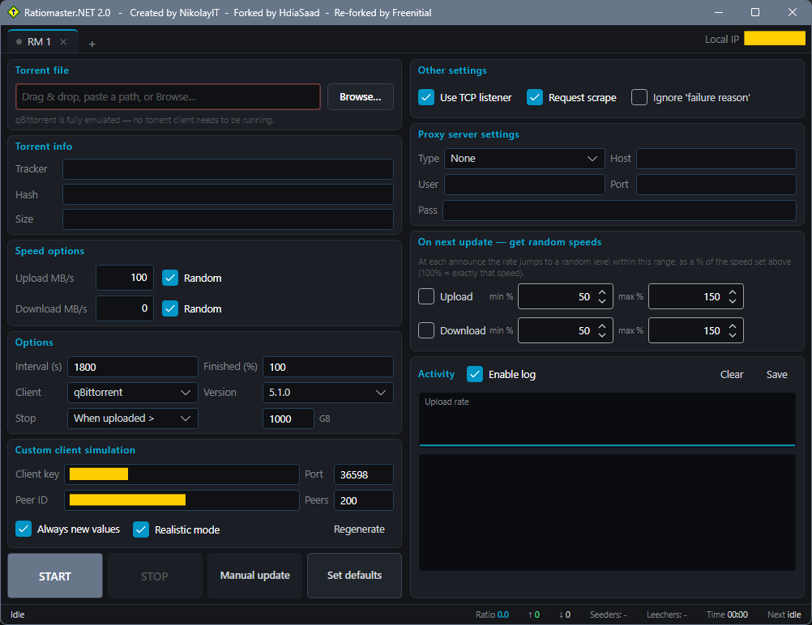

# RatioMaster.NET

Rewrite of RatioMaster.NET from WinForms to Avalonia 12 / .NET 11.



RatioMaster.NET reports fake upload/download figures to a BitTorrent tracker. It **emulates the
client itself**.

No torrent client has to be installed or running.

## Download

- [Windows x64](https://github.com/Freenitial/RatioMaster.NET/releases/latest/download/RatioMaster.NET_win-x64_v2.0.0.exe) — one file, nothing to install
- [Windows ARM64](https://github.com/Freenitial/RatioMaster.NET/releases/latest/download/RatioMaster.NET_win-arm64_v2.0.0.zip)
- [Linux x86_64](https://github.com/Freenitial/RatioMaster.NET/releases/latest/download/RatioMaster.NET_v2.0.0_x86_64.AppImage) — AppImage, `chmod +x` then run
- [Linux aarch64](https://github.com/Freenitial/RatioMaster.NET/releases/latest/download/RatioMaster.NET_v2.0.0_aarch64.AppImage)
- [Android](https://github.com/Freenitial/RatioMaster.NET/releases/latest/download/RatioMaster.NET_android_v2.0.0.apk)

## Quick start

1. **Pick the right torrent.** This matters more than any setting:
   - Prefer a torrent with **many leechers**. 
   - Even better: a torrent **you have actually downloaded**.
2. **Load it** - drag & drop the `.torrent` onto the window, paste its path, or use *Browse*.
3. **Set the upload speed** in MB/s. Keep it believable.
4. **START.**

Each tab is an independent session, so several torrents can run at once.

## Build

Development needs only the **.NET 11 SDK** (pinned in `global.json`):

```sh
dotnet run --project RatioMaster.App
```

Release artefacts are produced by one script, which self-installs whatever toolchain it needs:

```bat
Installer\build_RatioMaster_setup.bat
```

## Changelog

See [CHANGELOG.md](CHANGELOG.md).

## License

MIT - see [LICENSE](LICENSE). Originally by [NikolayIT](https://github.com/NikolayIT), HTTPS/TLS
rework by [HdiaSaad](https://github.com/HdiaSaad), this rewrite by Freenitial.
