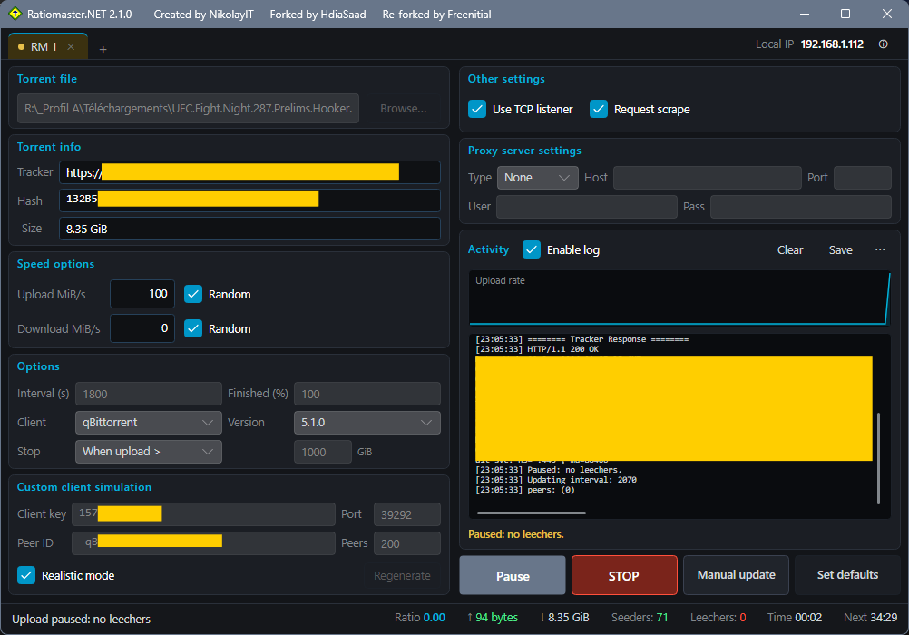

# RatioMaster.NET

A standalone BitTorrent tracker simulator built with Avalonia 12 and .NET 11.



RatioMaster.NET reports simulated upload/download figures to a tracker. No torrent client needs to be installed or running.

## Download

[Download the latest published release](https://github.com/Freenitial/RatioMaster.NET_2.0/releases/latest).

| Platform | Package |
|---|---|
| Windows x64 / ARM64 | Native AOT EXE with statically linked Skia and HarfBuzz |
| Linux x86_64 / aarch64 | Native AOT AppImage |
| Android | APK |
| macOS x64 / ARM64 | Local Native AOT application bundle; build on a Mac |

Local release builds are written to `Installer/Output`. Windows graphics libraries are neither distributed as separate DLLs nor extracted at startup. Windows rendering uses the software backend; ordinary Windows system APIs remain dependencies.

## Quick start

1. Load a `.torrent` using Browse, its path or drag and drop.
2. Select the client profile and set upload/download speeds in **MiB/s** (1 MiB = 1,048,576 bytes).
3. Choose a stop condition and press **START**.

Each tab owns its torrent, identity, counters and announce schedule. Pause/Resume keeps the identity stable and scheduled tracker updates active. Upload also pauses when the tracker reports no leechers and resumes through normal announces; a manual pause remains independent. Random controls remain separate for upload and download.

A tracker refusal stops the affected tab. Temporary transport errors preserve pending announce events for retry. Manual update requires confirmation; tracker timings and refusal messages must still be respected.

The tracker URL is editable while stopped. Resetting settings preserves the torrent's counters and the other tabs. The status bar colours seeder counts green and leecher counts red and wraps on compact screens.

## Terminal and information panel

The terminal keeps bounded queued traffic and retained text. Thin scrollbars have a larger transparent interaction area and do not expand over the text. The `…` menu provides a filter, copy and a follow toggle. Clear resets the terminal and graph without changing transferred counters; Set defaults also clears both. Copy and Save use displayed lines; clear the filter to export the full retained journal.

The `ⓘ` panel provides local diagnostics, an offline changelog and a manual GitHub update check. Opening it does not contact GitHub. Only a strictly newer stable release is offered, and opening a release page requires a separate click.

Shortcuts: Ctrl+O opens a torrent; Ctrl+T adds a tab; Ctrl+W closes the current tab; Ctrl+Enter starts/pauses/resumes; Ctrl+. stops; F5 opens the manual-update confirmation; Ctrl+Shift+C copies the hash. Escape and Android Back dismiss the topmost dialog.

## Saved settings

Windows and Linux portable settings stay beside the executable. An installation-specific local application-data directory is used if that location cannot be written. macOS keeps settings outside the signed app bundle; Android uses private app storage.

Saves use atomic replacement and a previous-snapshot backup. Setting changes and final torrent counters are preserved. A session in an ambiguous shared temporary folder is reported and left intact rather than assigned to another installation. Existing custom identities are retained; values whose origin cannot be established are treated as custom.

The default desktop window is 1000 × 668. Its extra height compensates for the larger status bar. Saved desktop layouts receive this adjustment once.

## Client profiles

| Family | Included versions |
|---|---|
| qBittorrent | 5.1.0 (default), 5.0.3, 4.6.7, 4.6.5, 5.2.3, 5.1.4 |
| µTorrent | 3.6.0 build 46828, 3.5.5 build 46074, 3.5.4 build 44498 |
| Transmission | 4.0.6 |
| Deluge | 2.1.1 with libtorrent 2.0.7.0 |
| BitTorrent | 7.10.3 build 44429 |

A client profile represents a particular construction, not every combination of version, platform and library. The qBittorrent and Deluge profiles allow pure v2 torrents. Transmission 4.0.6, µTorrent and BitTorrent profiles exclude pure v2; hybrids can use their v1 identity.

Peer IDs remain twenty raw bytes for the handshake and UDP, with profile-specific HTTP escaping. The editable field represents binary IDs as `hex:` followed by 40 hexadecimal digits. Generated µTorrent/BitTorrent keys follow a ten-minute refresh policy; custom keys remain unchanged. Transmission 4.0.6 uses a full 32-bit key with eight uppercase hexadecimal digits.

### Optional custom catalogue

A `clients.json` beside the desktop executable, or in the application settings directory on macOS/Android, is read at startup. It extends or overrides built-in family/version pairs without changing active sessions. It uses this application's format, not a directly copied upstream JSON file.

```json
{
  "format": 1,
  "default": "qBittorrent 5.1.0",
  "clients": [
    {
      "family": "qBittorrent",
      "version": "5.1.0",
      "numWant": 200
    },
    {
      "family": "Deluge",
      "version": "2.1.1 (libtorrent 1.2.15)",
      "base": "Deluge 2.1.1",
      "headers": [
        "Host: {host}",
        "User-Agent: Deluge/2.1.1 libtorrent/1.2.15.0",
        "Accept-Encoding: gzip",
        "Connection: close"
      ],
      "supportsV2": false
    }
  ]
}
```

`base` names a built-in profile. A matching family/version without `base` inherits that built-in definition. A new profile must provide its required fields; `default` must name a profile in the merged catalogue.

| Field | Accepted values |
|---|---|
| `httpProtocol` | `HTTP/1.0` or `HTTP/1.1` |
| `headers` | ASCII lines; one `Host: {host}` and one non-empty User-Agent |
| `query` | No leading `?`; required placeholders `{infohash}`, `{peerid}`, `{port}`, `{uploaded}`, `{downloaded}`, `{left}`, `{key}`, `{event}` exactly once |
| `peerIdPrefixHex` | Raw prefix, 1–20 bytes as hexadecimal |
| `peerIdLiteralPrefix` | Declared ASCII prefix retained literally in URLs |
| `peerIdTail` | `libtorrent`, `binary`, `transmission`; Transmission requires an eight-byte prefix |
| `peerIdByteMinimum`, `peerIdByteMaximum` | Inclusive binary-generator bounds, 0–255 |
| `urlEncoding` | `libtorrent`, `rfc3986`, `alphanumeric` |
| `hashUpperCase`, `peerIdUpperCase` | Case of hexadecimal escape digits |
| `keyLength`, `keyUpperCase` | 1–8 hexadecimal digits and explicit case |
| `keyRefreshSeconds` | 0, or 60–86400; generated keys only |
| `numWant` | 0–200; a query containing numwant must use `{numwant}` |
| `supportsV2` | Capability of the represented construction |

Limits: UTF-8 with or without BOM, 1 MiB, 128 entries and 16 nesting levels. Unknown/duplicate fields, invalid placeholders, impossible identities and authentication/transport headers are rejected. Compression offers must use supported decoders. Any error rejects the complete external file and retains the built-in catalogue, with a visible diagnostic.

The rules draw on [upstream client definitions](https://github.com/NikolayIT/RatioMaster.NET/blob/fa5a815b8384fce44f5d2a60c52898939cf681c1/src/RatioMaster.Core/Clients/clients.json), [libtorrent](https://github.com/arvidn/libtorrent/tree/v2.0.7/src), [Deluge](https://github.com/deluge-torrent/deluge/blob/deluge-2.1.1/deluge/core/core.py) and [Transmission](https://github.com/transmission/transmission/tree/4.0.6/libtransmission). Correct byte formatting and local fixtures do not certify complete client emulation or tracker acceptance.

## Build and validation

Use the .NET 11 SDK selected by `global.json`; Avalonia remains on stable 12.0.5.

```sh
dotnet run --project RatioMaster.App
```

The graphical builder can acquire its required toolchains. Headless mode uses installed tools and does not open UAC or installer dialogs:

```bat
Installer\build_RatioMaster_setup.bat
Installer\build_RatioMaster_setup.bat --headless --winx64 --winarm64 --apk --linux
```

Use `--check-tools` for a preflight without compilation, `--aot` for a bare x64 publish, and `--aab` for an Android App Bundle. An Android signing keystore can be supplied with `RM_ANDROID_KEYSTORE`, `RM_ANDROID_KEYSTORE_PASS`, `RM_ANDROID_KEY_ALIAS` and `RM_ANDROID_KEY_PASS`; otherwise a debug keystore is used. A debug-signed AAB is not suitable for Google Play.

Canonical output directories are `RatioMaster.App/publish/<RID>` and `Installer/Output`. Linux uses existing WSL native tools and appimagetool; missing prerequisites have an explicit self-contained JIT/archive fallback.

On macOS, with Xcode command-line tools:

```sh
bash Installer/package_macos.sh osx-arm64
bash Installer/package_macos.sh osx-x64
```

This creates a Native AOT `.app`, ZIP and SHA-256 file. Its ad hoc signature is checked locally; it is not Developer ID signing or notarisation. An existing destination bundle is not overwritten.

Regression tests live in `Tests/`, compile only into desktop Debug builds and use local fixtures. They protect protocol handling, saved settings, independent tabs and responsive layouts. Keep them even when feature development slows down:

```powershell
powershell -NoProfile -ExecutionPolicy Bypass -File .\Installer\validate_RatioMaster.ps1
```

On Linux/macOS, run the same script with PowerShell 7 (`pwsh`). It builds and executes suites sequentially for the host architecture, isolates temporary data and writes ignored logs under `Installer/Output/validation`. The GitHub workflow uses separate Windows/Linux/macOS jobs. Do not run builds sharing the same `obj` concurrently.

A small `--runtime-selftest` diagnostic remains in desktop release binaries to check native graphics, embedded release history and serialization without opening sessions or using the network. Compilation and this diagnostic do not replace Android/ARM64 device testing or a macOS run.

## Release history and credits

See [CHANGELOG.md](CHANGELOG.md). The next release description is prepared in [RELEASE_NOTES.md](RELEASE_NOTES.md).

MIT — see [LICENSE](LICENSE). Originally by [NikolayIT](https://github.com/NikolayIT), HTTPS/TLS work by [HdiaSaad](https://github.com/HdiaSaad), and this fork by Freenitial. Recent upstream development was reviewed and adapted while retaining this fork's tabbed interface and standalone emulation.
